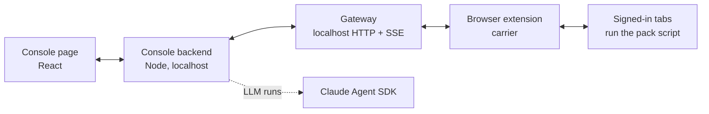

# Work Console core

One page for the work a developer juggles across many tools: issues, pull requests, builds, chats,
mail, meetings and timesheets. Work runs as **jobs**. Each job follows a **playbook** of steps, and
an LLM drafts the text for a step. **A person reviews every draft and sends it.**

This repo is the tool-agnostic core. Your workplace plugs in through a **pack**, which maps its
tools (Jira, GitHub, Slack and so on) onto the core's concepts. The demo runs a fictional workplace,
Acme, on in-memory data, with no backend, no browser and no cloud.


*The console only talks to the gateway. The gateway reaches the tools through the user's own
signed-in browser tabs. Nothing runs in a cloud of ours.*

## Try it

```bash
cd console
npm ci
npm run dev          # the page alone, demo data, http://localhost:5173
npm test             # model + backend units against a fake gateway
npm run build        # dist/index.html (served by the backend) and dist/artifact.html (standalone demo)
WORK_CONSOLE_FAKE_GATEWAY=1 npm start   # the backend on http://127.0.0.1:7410 against the fake gateway
```

Pack contract tests run from the repo root:

```bash
node --test "packs/**/test/*.test.mjs"
```

## Layout

| Path | What it is |
|---|---|
| `console/src/` | The page: model (jobs, playbooks, transitions), views, and demo data under `data/` |
| `console/server/` | Backend: job store, LLM runner, notifications, MCP job tools, and the gateway client plus fake |
| `console/workspaces/` | Workspaces: the registries, and two fictional examples (`acme`, `beta`) a workplace copies |
| `schemas/` | JSON schemas for every concept item and detail a pack returns |
| `packs/example/` | A worked pack (Jira `work` read/get and `work.comment`) with contract tests |
| `docs/` | Architecture, the gateway protocol, how to write a pack, the extension carrier, the roadmap |

## Status

| Part | State |
|---|---|
| Page, model, playbooks, backend | Working; covered by unit tests |
| Fake gateway (`console/server/bridge/fake.ts`) | Working; it is the reference for the protocol |
| Real gateway | Not here yet; [docs/roadmap.md](docs/roadmap.md) |
| Extension carrier | Design only; [docs/extension-carrier.md](docs/extension-carrier.md) |
| Packs | `example` only; the mapping per tool is in [docs/concept-mapping.md](docs/concept-mapping.md) |
