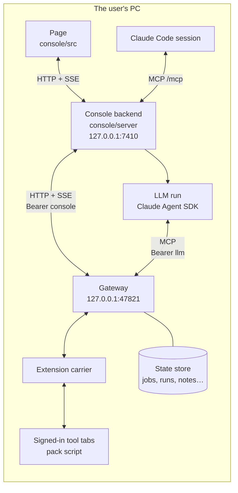
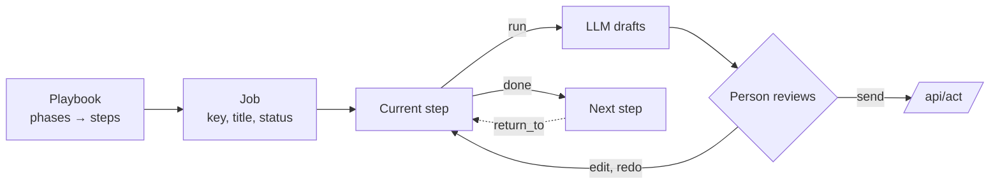
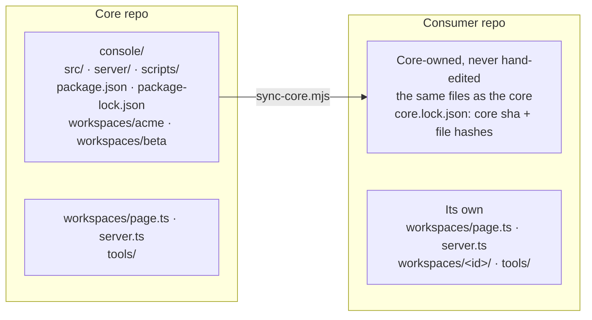
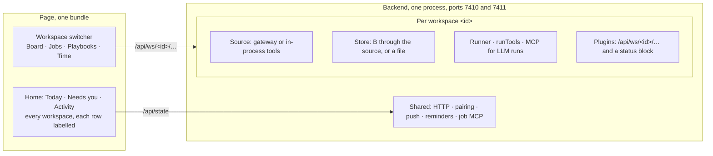

# Architecture

*Every box runs on one PC. The backend sees only the gateway. Tools are reached through tabs the
user already signed into, so no credential is ever stored.*

## Two kinds of concept

| Group | Concepts | Served by | Written by |
|---|---|---|---|
| A, sources | `work`, `board`, `review`, `chat`, `mail`, `cal`, `ci`, `tickets`, `docs`, `time` | the pack, in a tab | `/api/act`, only after a person confirms |
| B, state | `jobs`, `runs`, `playbooks`, `marks`, `notes`, `proposals` | the gateway's store | `/api/state/put` (compare-and-set on `v`) |

Each A concept is a list of items plus a detail by id; its schema is `schemas/<concept>.item.schema.json`
and `schemas/<concept>.get.schema.json`. A concept that cannot answer reports an error code and
the page shows it as unavailable, never as empty.

## Jobs, playbooks, steps

*A job walks a playbook one step at a time. A step may ask the LLM for a draft, and only a person
turns a draft into an act. A later step can send the job back to an earlier one, which starts a
new round.*

- Core playbooks live in `console/src/data/playbooks.ts`; a workspace's own in its `page.ts`. A playbook
  without `ws` is core and is offered in every workspace; one with `ws` belongs to that workspace.
- The transition rules (start, done, skip, return, block, rounds) are in `console/src/model/transitions.ts`.
  The page and the backend share them.
- A workplace is described by a `Pack` in its workspace's `page.ts`: its tool names per concept,
  its projects, its vote words and its second clock.

## Workspaces

*Sync copies all of `console/` except the two registries and `tools/`, which belong to the consumer.
`acme` and `beta` come along as fixtures, because core tests import them.*

*Each workspace gets its own source, store and runner. Everything bound to the PC, not to a workplace,
is shared.*

### Workspace contract

`workspaces/<id>/page.ts` is imported by the page and by the backend, so Node must be able to load it:
no `.tsx` and no DOM at load.

| Field | What |
|---|---|
| `id`, `pack` | name, vocabulary, sources, `tz` and `tzl` (the `Pack`) |
| `playbooks`, `templates` | built-in playbooks and their planned messages; playbook ids are unique across workspaces and apart from the core's |
| `demo` | jobs, chats and log, plus optional mail, calendar, board and time, for the mode without a gateway |
| `board` | `itemId(key)` gives the item id in a key or `null`; `key(id)` gives the job key; `start` names the playbook Start uses |
| `acts` | step-action buttons beyond the core's `time`; act names are unique across workspaces |
| `me` | the user's name in prompts and on the board; unset, prompts say `the user` and the board says `You` |

`workspaces/<id>/ui.tsx` is optional and page-only: the handlers behind `acts` and the dialogs to mount.
Only `workspaces/page.ts` imports it.

`workspaces/<id>/server.ts` is imported by the backend only:

| Field | What |
|---|---|
| `page`, `jobPrefix` | the page half; job ids are `<prefix>-NNNN`, with a prefix matching `^[A-Z][A-Z0-9]{0,7}$`, unique |
| `defaults` | config defaults: `gatewayUrl`, `consoleTokenPath`, `llmTokenPath`, `workDir`, `runTools`, `teamTz`, `maxSessions`, and the workspace's own keys |
| `source(cfg, { bus })` | a `Bridge`; the default is the HTTP gateway client |
| `store(source, cfg, { bus, home })` | the default is B through the source |
| `llm` | the default `runTools` and the MCP servers for its LLM runs; `llm.mcp` may not name `bridge` or `run` |
| `plugins(ctx)` | routes under `/api/ws/<id>/…` and a block in `/api/state` |
| `fake()` | what the fake gateway starts with; the default is derived from `page.demo` |

- **Registries.** `workspaces/page.ts` lists the pages (`WORKSPACES`) and `workspaces/server.ts` the
  servers (`SERVERS`); the first of each is the default. Startup refuses a malformed or duplicate id, a
  malformed or duplicate prefix, and a playbook id built into two workspaces, and the message names them.
- **Config.** `config.json` holds PC-wide keys at its top and each workspace's under `workspaces.<id>`,
  with the keys of `defaults`. A workspace key left at the top applies to the only workspace, with a
  startup line per key saying where to move it. With two or more workspaces startup refuses and names the key.
- **Routes.** Everything bound to a workspace lives under `/api/ws/<id>/`: concept reads, acts, board,
  playbooks, knowledge, chat and mail marks, and plugins. Job and run routes stay `/api/jobs/…` and
  `/api/runs/…`: a job id finds its workspace by its prefix, and an id nobody owns answers 404 naming it.
  Pairing, push, events and artifacts are shared.
- **State.** `/api/state` returns `home` (the PC zone and name) and one block per workspace. A workspace
  whose gateway is down says `unavailable` in its block, never no jobs, and the others carry on. Events
  carry `ws`.
- **Job MCP.** One server for all workspaces. Job tools find the workspace by the job id's prefix;
  `create_job` and `start_item` take `ws`, which may be omitted while one workspace is registered.
- **Home.** It merges every workspace's calendar, `needsYou` and Activity, labelling each row by workspace.
  The page sets its zone from `home.tz`; demo mode keeps the device zone.

### Sync and drift

| Step | What happens |
|---|---|
| Read | `sync-core.mjs` reads the core at `--ref` (default `HEAD`) with `git ls-tree` and `git cat-file`; the working tree is never read |
| Write | every file of `console/` except `workspaces/page.ts`, `workspaces/server.ts` and `tools/` |
| Delete | files the previous lock listed and this commit no longer has |
| Lock | `core.lock.json`: `{ core: <sha>, files: { <path>: <sha256> } }` |

- **Refuses** when a locked file was edited in the consumer, or when an unlocked consumer file would be
  overwritten; the message lists the paths. A CRLF-only difference is not an edit, since hashes treat CRLF
  as LF. `--force` overrides. The first sync has no lock, checks nothing and logs how many existing files
  it replaces.
- **Drift test** `server/core-lock.test.ts` runs in `npm test`. It fails when a locked file is missing or
  differs, or when a file outside `workspaces/`, `tools/` and build output is not in the lock. It skips in
  the core, which has no lock.
- **Rule.** A generic change is a core commit, then a consumer commit that only syncs. A workspace change
  touches only `workspaces/<id>/`.
- A workspace command runs as `node --experimental-strip-types workspaces/<id>/…`, never as an npm
  script, because `package.json` is core-owned.

## LLM runs

`console/server/llm/` runs one step at a time through the Claude Agent SDK.

- The prompt is built from the job, the step and the playbook's instructions.
- The run's tools come from the allowlist in `sdk.ts`: it can read A, search knowledge, and propose
  a note. It cannot act, and it cannot write B.
- The run hands back its draft with `submit_draft`. The page shows the draft, and a person sends it.
- The gateway serves the run's read tools as MCP at `{gateway}/mcp` with the `llm` token. The fake
  gateway does not serve `/mcp`, so a demo run uses the fake SDK in tests.

## Claude Code access

The backend serves its own MCP at `127.0.0.1:7410/mcp` (`console/server/mcp/mcp.ts`). It offers
the job tools (`list_jobs`, `get_job`, `job_command`, `job_context`, `return_to`, `create_job`,
`start_item`, `undo`, `list_playbooks`), so a terminal session can move jobs without the page. These
are job commands, not source acts. It is one server for every workspace: a job id names its workspace
by its prefix, and `create_job` and `start_item` take `ws`, which may be omitted while only one
workspace is registered.

## Notifications

`console/server/notify/` turns deltas into short notices: a new review vote, a red build, a
mention, a reminder. The page receives them over SSE. A phone gets them over the LAN port
7411 after pairing (`console/server/pairing/`).
