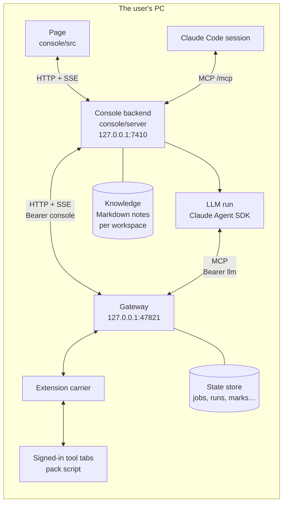
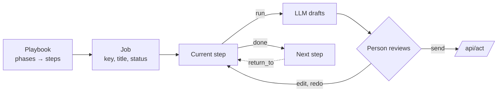
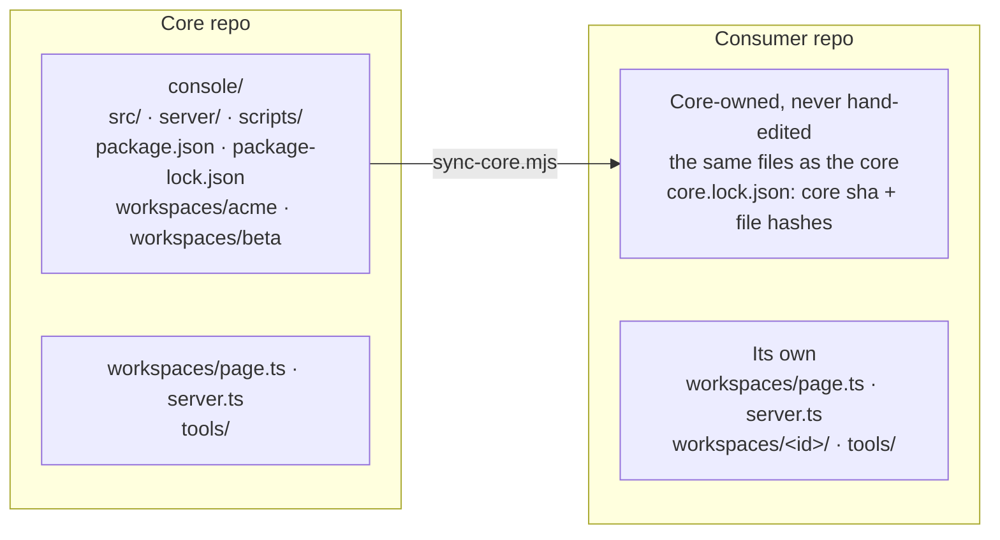
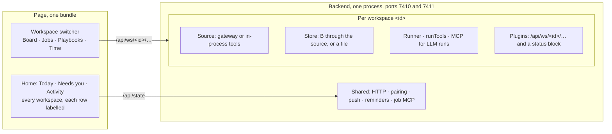

# Architecture

*Every box runs on one PC. The backend sees only the gateway. Tools are reached through tabs the
user already signed into, so no credential is ever stored.*

## Two kinds of concept

| Group | Concepts | Served by | Written by |
|---|---|---|---|
| A, sources | `work`, `board`, `review`, `chat`, `mail`, `cal`, `ci`, `tickets`, `docs`, `time` | the pack, in a tab | `/api/act`, only after a person confirms |
| B, state | `jobs`, `runs`, `playbooks`, `marks` | the gateway's store | `/api/state/put` (compare-and-set on `v`) |

Each A concept is a list of items plus a detail by id; its schema is `schemas/<concept>.item.schema.json`
and `schemas/<concept>.get.schema.json`. A concept that cannot answer reports an error code and
the page shows it as unavailable, never as empty.

## Jobs, playbooks, steps

*A job walks a playbook one step at a time. A step may ask the LLM for a draft, and only a person
turns a draft into an act. A later step can send the job back to an earlier one, which starts a
new round.*

- Core playbooks live in `console/src/data/playbooks.ts`; a workspace's own in its `page.ts`. A playbook
  without `ws` is core and is offered in every workspace; one with `ws` belongs to that workspace.
- A playbook added in the page, or made by the job builder, is stored with its planned messages, as
  the state document `{pb, tpl}`. The backend's templates are the core's, the workspace page's and
  every stored playbook's, so a planned message can be marked sent on any playbook.
- `needs` says in plain words what context a playbook's jobs need. A playbook with `once: 1` holds
  one job's own steps: no playbook list, the builder's catalog or `list_playbooks` shows it.
- The transition rules (start, done, skip, return, block, rounds) are in `console/src/model/transitions.ts`.
  The page and the backend share them.
- A workplace is described by a `Pack` in its workspace's `page.ts`: its tool names per concept,
  its projects, its vote words and its second clock.

## Workspaces

*Sync copies all of `console/` except the two registries and `tools/`, which belong to the consumer.
`acme` and `beta` come along as fixtures, because core tests import them.*

*Each workspace gets its own source, store and runner. Everything bound to the PC, not to a workplace,
is shared.*

### Workspace contract

`workspaces/<id>/page.ts` is imported by the page and by the backend, so Node must be able to load it:
no `.tsx` and no DOM at load.

| Field | What |
|---|---|
| `id`, `pack` | name, vocabulary, sources, `tz` and `tzl` (the `Pack`) |
| `playbooks`, `templates` | built-in playbooks and their planned messages; playbook ids are unique across workspaces and apart from the core's |
| `demo` | jobs, chats and log, plus optional mail, calendar, board and time, for the mode without a gateway |
| `board` | `itemId(key)` gives the item id in a key or `null`; `key(id)` gives the job key; `start` names the playbook Start uses; `ready` is the column a free item waits in (default `Ready`) and `dev` the column and state Start moves it to (default `Dev`, `In Progress`) |
| `acts` | step-action buttons beyond the core's `time`; act names are unique across workspaces. The Time view links to the job at a `time` step, else an open job whose playbook has one, else a recurring job with `timesheet` in its title or key |
| `me` | the user's name in prompts, in the context of a run and on the board; unset, prompts and context say `the user` and the board says `You` |
| `reviewMark` | what a review id is written with, as in `review #482`; default `#` |

`workspaces/<id>/ui.tsx` is optional and page-only: the handlers behind `acts` and the dialogs to mount.
Only `workspaces/page.ts` imports it.

`workspaces/<id>/server.ts` is imported by the backend only:

| Field | What |
|---|---|
| `page`, `jobPrefix` | the page half; job ids are `<prefix>-NNNN`, with a prefix matching `^[A-Z][A-Z0-9]{0,7}$`, unique. The default store renames the gateway's `J-NNNN` to `<prefix>-NNNN` |
| `defaults` | config defaults: `gatewayUrl`, `consoleTokenPath`, `llmTokenPath`, `workDir`, `runTools`, `teamTz`, `maxSessions`, `knowledgeDir`, and the workspace's own keys. The core's `workDir` is the repo around the console: the nearest folder with a `.git`, else the console's parent |
| `source(cfg, { bus })` | a `Bridge`; the default is the HTTP gateway client |
| `store(source, cfg, { bus, home })` | the default is B through the source |
| `llm` | the default `runTools` and the MCP servers for its LLM runs; `llm.mcp` may not name `bridge` or `run` |
| `plugins(ctx)` | routes under `/api/ws/<id>/…` and a block in `/api/state` |
| `fake()` | what the fake gateway starts with; the default is derived from `page.demo`; its optional `get` answers a get of a concept's item instead of the item itself, and one that throws answers 500 naming the error |

- **Building.** `source`, `store`, `plugins` and `fake` must not throw while being built: a throw at
  startup stops every workspace. A setup problem is reported when the workspace is called, for example
  as a 409 `not_set_up`.
- **Registries.** `workspaces/page.ts` lists the pages (`WORKSPACES`) and `workspaces/server.ts` the
  servers (`SERVERS`); the first of each is the default. Startup refuses a malformed or duplicate id, a
  malformed or duplicate prefix, and a playbook id built into two workspaces, and the message names them.
- **Config.** `config.json` holds PC-wide keys at its top and each workspace's under `workspaces.<id>`,
  with the keys of `defaults`. A workspace key left at the top applies to the only workspace, with a
  startup line per key saying where to move it. With two or more workspaces startup refuses and names the key.
- **Routes.** Everything bound to a workspace lives under `/api/ws/<id>/`: concept reads, acts, board,
  playbooks, knowledge, transcribe, chat and mail marks, and plugins. Job and run routes stay `/api/jobs/…` and
  `/api/runs/…`: a job id finds its workspace by its prefix, and an id nobody owns answers 404 naming it.
  Pairing, push, events and artifacts are shared.
- **State.** `/api/state` returns `home` (the PC zone and name), `voice` (whether the PC has an OpenAI
  key) and one block per workspace. A workspace
  whose gateway is down says `unavailable` in its block, never no jobs, and the others carry on. Events
  carry `ws`.
- **Job MCP.** One server for all workspaces. Job tools find the workspace by the job id's prefix;
  `create_job` and `start_item` take `ws`, which may be omitted while one workspace is registered.
- **Home.** It merges every workspace's calendar, `needsYou` and Activity, labelling each row by workspace.
  The page sets its zone from `home.tz`; demo mode keeps the device zone.

### Sync and drift

| Step | What happens |
|---|---|
| Check target | `--to` must already hold `workspaces/page.ts` and `workspaces/server.ts`, or the sync stops before reading anything |
| Read | `sync-core.mjs` reads the core at `--ref` (default `HEAD`) with `git ls-tree` and `git cat-file`; the working tree is never read |
| Write | every file of `console/` except `workspaces/page.ts`, `workspaces/server.ts` and `tools/` |
| Delete | files the previous lock listed and this commit no longer has; the consumer's own files are never deleted. This runs before the writes, so a file the core renamed only in case is rewritten, not lost on a case-insensitive disk |
| Lock | `core.lock.json`: `{ core: <sha>, files: { <path>: <sha256> } }` |

- **Refuses** when a locked file was edited in the consumer, or when an unlocked consumer file would be
  overwritten; the message lists the paths. A CRLF-only difference is not an edit, since hashes treat CRLF
  as LF. `--force` overrides. The first sync has no lock, checks no edits and logs how many existing files
  differ from the core and are replaced.
- **Paths.** Every path of the core tree and every key of the old lock must be a plain relative path that
  stays under `--to`; otherwise the sync stops before writing and names it.
- **Drift test** `server/core-lock.test.ts` runs in `npm test` and calls `drift()` of `sync-core.mjs`,
  which is tested in `scripts/sync-core.test.ts`. It fails when a locked file is missing or differs, when
  a file outside `workspaces/`, `tools/` and build output is not in the lock, and when there is no lock.
  It skips only in the core's own layout, with `schemas/` and `packs/` beside `console/`.
- **Rule.** A generic change is a core commit, then a consumer commit that only syncs. A workspace change
  touches only `workspaces/<id>/`.
- A workspace command runs as `node --experimental-strip-types workspaces/<id>/…`, never as an npm
  script, because `package.json` is core-owned.

### Workspaces without a gateway

A workspace may have no gateway: its jobs live in PostgreSQL and its runs work in git worktrees on the PC.

| Piece | What |
|---|---|
| Source and store | `pgSource({ url, password, schema, ws, bus })` (`server/store/pg.ts`) is both. The source is up while the database answers; `store()` keeps jobs, runs, playbooks and marks in `schema`, default `work_console`. A write is compare-and-set on `v`, and a NOTIFY tells the other consoles on the same database what changed |
| Work dir | `workDir(cfg)` returns `gitWorktrees({ repos, root })` (`server/llm/worktree.ts`). Before a job's first run the console adds a worktree of the repo its project names, on `job/<id>` from `base`, at `root/<id>`, and links `links` in from the main checkout. On close it removes a clean worktree and a branch merged into `base`, keeps anything else, and journals one line |
| `llm.bridge: false` | no bridge MCP server, no bridge tools, no LLM token read |
| `llm.screenshot` | the run tool `screenshot`: a png of an http, https or file url, kept as the step's artifact. The file url, and every file the page loads, must be under the run's dir. It reaches any http url, so it is only for workspaces whose runs read no untrusted text. `browserPath` in `config.json` picks the browser; unset, an installed Edge or Chrome |
| `llm.jobTools` | the run tools `create_job` and `start_job`, in the run's workspace only. Defaults: playbook `board.start`, the pack's first project. At most 5 creates a run; the new job is signed `LLM` and its journal names the job it came from |

## LLM runs

`console/server/llm/` runs one step at a time through the Claude Agent SDK.

- The prompt carries what the run needs, read at its start, so the run works instead of reading (see the table below).
- The run's tools come from the allowlist in `sdk.ts`: it can read A, and search, read and propose the
  workspace's knowledge notes. It cannot act, and it cannot write B beyond its own step, plus the jobs `llm.jobTools` lets it create and start.
- It keeps files with `add_artifact` and `add_artifact_file` (a file under its dir, at most 20 MB).
  Images show on the page; html and svg are served as text.
- It never reads the console home: the deny list covers `.work-console` for Read, Bash and PowerShell.
- The run hands back its draft with `submit_draft`. The page shows the draft, and a person sends it.
- The gateway serves the run's read tools as MCP at `{gateway}/mcp` with the `llm` token. The fake
  gateway does not serve `/mcp`, so a demo run uses the fake SDK in tests.

What a run's prompt holds, in this order (`console/server/llm/prompt.ts`):

| Part | What |
|---|---|
| Pictures | the pictures the context's work items name, at most 20, each after a line `[image N] <item>, <where>: <name>` that the text's `[image N]` points at; they come before the text |
| Job | id, title, key, playbook, project, step, exit criterion, expected artifacts, work dir |
| Context | each context item read through the bridge: a work item with its newest comments, a chat's newest messages, a mail whole. An item that cannot be read is a line saying why |
| Knowledge | the job's notes and its playbook's notes, in full, each once |
| Earlier outputs | every step's output so far |
| Journal | the latest 20 entries, oldest first |
| How to work | tools only for what the prompt lacks; nothing is sent; journal, artifacts, `submit_draft` |
| Description | the job's description: the user's own words, Markdown |
| Instruction | what the user asked this run |

- The run tool `context` returns the same parts but How to work, pictures included, read anew, for a long run whose first prompt is far behind it.
- A resumed run keeps its session and gets one line; it reads nothing until it calls `context`.

## Knowledge

Each workspace has a folder of Markdown notes: `knowledgeDir` in its config, default
`<home>/knowledge/<id>`. The store is `console/server/knowledge/notes.ts`.

| What | How |
|---|---|
| A note | `<id>.md`: front matter whose values are JSON (`title`, `tags`, `playbooks`, `v`, `updated`), then the text, at most 64 KB. The id is the title's slug and never changes |
| An edit | names the `v` it replaces. A stale one is a 409 and writes nothing. A write goes to a temp file and is renamed into place |
| A proposal | an LLM's new note or change, kept in `.proposals/P-NNNN.json`; ids never repeat. Approvals accepts it, edits then accepts it, or rejects it. Accepting a change whose note moved on is a 409, and the proposal stays |
| Search | in memory over every note, on each call: title ×3, tags ×2, text ×1, with a snippet. A file edited by hand shows on the next read |
| Events | a write emits a `source` event, `notes` or `proposals`, for the page; a new proposal sends a Web Push |

- Routes live under `/api/ws/<id>/knowledge` and work the same with or without a gateway.
- With the fake gateway, notes live under the console home, never in a configured folder.
- A run's prompt carries the job's notes and its playbook's notes in full. It also gets
  `knowledge_search`, `knowledge_read` and `knowledge_propose` as its own tools, for the other notes; its
  proposals are signed `run <job>/<step>`. A Claude Code session gets the same three on the
  console MCP, signed `session`. Neither goes through the gateway.

## Voice

The New job form takes speech. The page records with MediaRecorder, which needs a secure context
(`http://127.0.0.1:7410` or the LAN's `https`), and sends the recording to
`POST /api/ws/<id>/transcribe {audio, mime}`: base64 audio in a JSON body of up to 30 MB. The backend
hands it to OpenAI's `whisper-1` (`console/server/voice/whisper.ts`) and answers `{text}`.

- The key is the file `openai.key` in the console home, read on every call, so placing or rotating it
  needs no restart. `openaiKeyPath` in `config.json` moves it.
- `/api/state` says `voice: true` while the key is there. With none, the page hides the mic, typing
  still works, and the route answers 503 `no_key`.
- The key never reaches an answer or a log: OpenAI's messages, which can quote part of it, are scrubbed
  first. A page that drops the request aborts the call.

### The builder

The says fill the form: `POST /api/ws/<id>/build {id, say[], form}` answers `{form}`
(`console/server/llm/builder.ts`). Each build is one read-only Agent SDK session.

| Part | What |
|---|---|
| Prompt | the workspace and its projects; now, in the home zone; the playbook catalog with each playbook's `needs` and steps; the note index; whether there are sources; the form as it stands; every say, oldest first |
| Tools | `knowledge_search` and `knowledge_read`. With a gateway, also `source_list` (one concept's list, newest first, at most 50) and `source_get` (one item, as a run would get it). The session loads no settings and keeps no transcript; it has no built-in tools |
| Answer | the whole form, in a JSON schema: title and description in English, a catalog playbook or new steps (`once` = this job only), context, due |
| Check | the playbook and project against the workspace; the context as a job keeps it; due as ISO; new steps by Add playbook's rules, and every `{word}` in their messages must be filled by a step. A failing field stays in the form, and its reason goes into `why` |

- The catalog leaves out other workspaces' playbooks and one job's own steps.
- A due with only a day means 18:00 that day, home time.
- New steps get a key that no workspace holds: their slug, with `once-` in front for one job's steps,
  then `-2`, `-3`… on a clash.
- A later say is sent with every earlier one and the form as the user left it. A field the says do
  not touch keeps its value.
- Each tool call is a `build` event carrying the build's id, so the page shows what the builder reads.
- A build stops after 120 s (504), when the page drops the request (499), or when Claude Code is
  signed out (503).

## Claude Code access

The backend serves its own MCP at `127.0.0.1:7410/mcp` (`console/server/mcp/mcp.ts`). It offers
the job tools (`list_jobs`, `get_job`, `job_command`, `job_context`, `return_to`, `create_job`,
`start_item`, `undo`, `list_playbooks`), so a terminal session can move jobs without the page, and
the knowledge tools (`knowledge_search`, `knowledge_read`, `knowledge_propose`). These are console
commands, not source acts. It is one server for every workspace: a job id names its workspace by its
prefix, and `create_job`, `start_item` and the knowledge tools take `ws`, which may be omitted while
only one workspace is registered.

## Notifications

`console/server/notify/` turns deltas into short notices: a new review vote, a red build, a
mention, a reminder. The page receives them over SSE. A phone gets them over the LAN port
7411 after pairing (`console/server/pairing/`).
