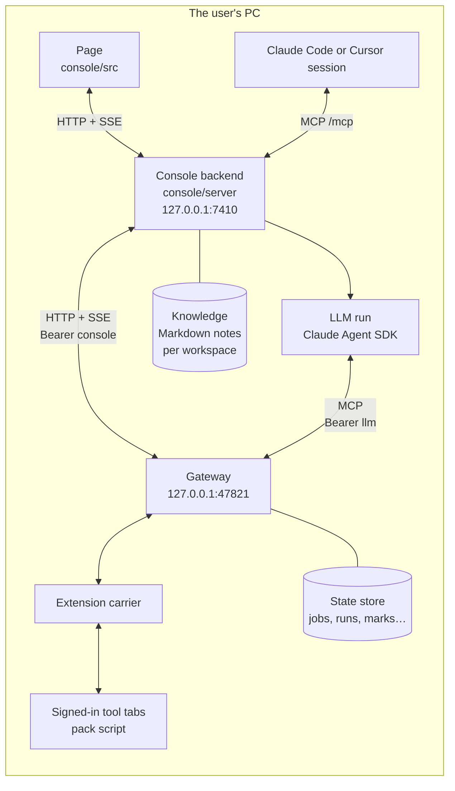
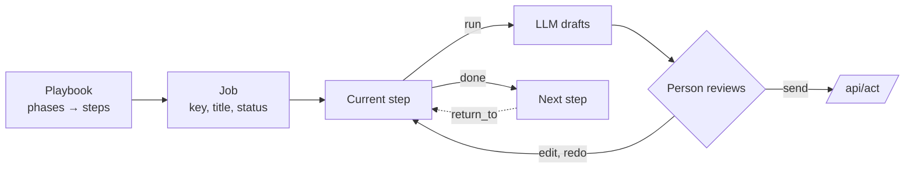
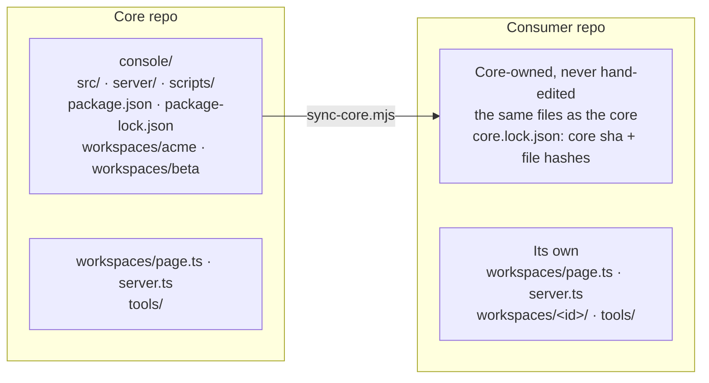
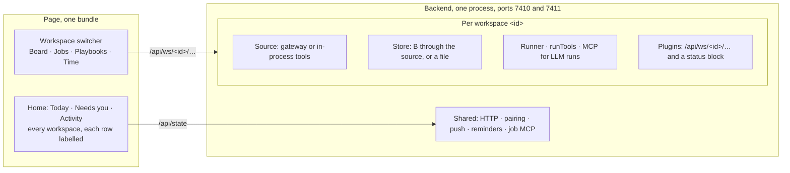
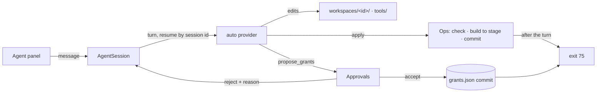
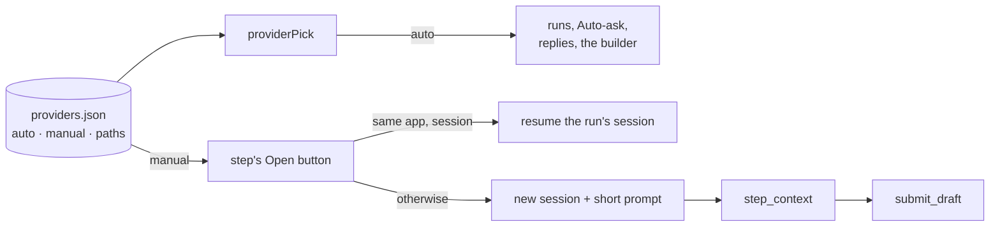
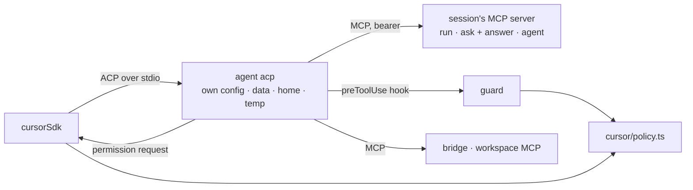

# Architecture

*Every box runs on one PC. The backend sees only the gateway. Tools are reached through tabs the
user already signed into, so no credential is ever stored.*

## Two kinds of concept

| Group | Concepts | Served by | Written by |
|---|---|---|---|
| A, sources | `work`, `board`, `review`, `chat`, `mail`, `cal`, `ci`, `tickets`, `docs`, `time` | the pack, in a tab | `/api/act`, only after a person confirms |
| B, state | `jobs`, `runs`, `playbooks`, `marks` | the gateway's store | `/api/state/put` (compare-and-set on `v`) |

Each A concept is a list of items plus a detail by id; its schema is `schemas/<concept>.item.schema.json`
and `schemas/<concept>.get.schema.json`. A concept that cannot answer reports an error code and
the page shows it as unavailable, never as empty.

## Jobs, playbooks, steps

*A job walks a playbook one step at a time. A step may ask the LLM for a draft, and only a person
turns a draft into an act. A later step can send the job back to an earlier one, which starts a
new round.*

- Core playbooks live in `console/src/data/playbooks.ts`; a workspace's own in its `page.ts`. A playbook
  without `ws` is core and is offered in every workspace; one with `ws` belongs to that workspace.
- A playbook added in the page, or made by the job builder, is stored with its planned messages, as
  the state document `{pb, tpl}`. The backend's templates are the core's, the workspace page's and
  every stored playbook's, so a planned message can be marked sent on any playbook.
- A planned message is `[via, to, text]`: a chat by name, a comment on the job's work item, or a mail.
  A mail without `to` replies to the job's mail; one with `to` is a new mail, `to` its addresses and a
  fourth element `{cc, subject}` its head. The send dialog shows To, CC and Subject for the user to check.
- `needs` says in plain words what context a playbook's jobs need. A playbook with `once: 1` holds
  one job's own steps: no playbook list, the builder's catalog or `list_playbooks` shows it.
- The transition rules (start, done, skip, return, block, rounds) are in `console/src/model/transitions.ts`.
  The page and the backend share them.
- A workplace is described by a `Pack` in its workspace's `page.ts`: its tool names per concept,
  its projects, its vote words and its second clock.

## Workspaces

*Sync copies all of `console/` except the two registries and `tools/`, which belong to the consumer.
`acme` and `beta` come along as fixtures, because core tests import them.*

*Each workspace gets its own source, store and runner. Everything bound to the PC, not to a workplace,
is shared.*

### Workspace contract

`workspaces/<id>/page.ts` is imported by the page and by the backend, so Node must be able to load it:
no `.tsx` and no DOM at load.

| Field | What |
|---|---|
| `id`, `pack` | name, vocabulary, sources, `tz` and `tzl` (the `Pack`) |
| `playbooks`, `templates` | built-in playbooks and their planned messages; playbook ids are unique across workspaces and apart from the core's |
| `demo` | jobs, chats and log, plus optional mail, calendar, board and time, for the mode without a gateway |
| `board` | `itemId(key)` gives the item id in a key or `null`; `key(id)` gives the job key; `start` names the playbook Start uses; `ready` is the column a free item waits in (default `Ready`) and `dev` the column and state Start moves it to (default `Dev`, `In Progress`) |
| `acts` | step-action buttons beyond the core's `time`; act names are unique across workspaces. The Time view links to the job at a `time` step, else an open job whose playbook has one, else a recurring job with `timesheet` in its title or key |
| `me` | the user's name in prompts, in the context of a run and on the board; unset, prompts and context say `the user` and the board says `You` |
| `reviewMark` | what a review id is written with, as in `review #482`; default `#` |

`workspaces/<id>/ui.tsx` is optional and page-only: the handlers behind `acts` and the dialogs to mount.
Only `workspaces/page.ts` imports it.

`workspaces/<id>/server.ts` is imported by the backend only:

| Field | What |
|---|---|
| `page`, `jobPrefix` | the page half; job ids are `<prefix>-NNNN`, with a prefix matching `^[A-Z][A-Z0-9]{0,7}$`, unique. The default store renames the gateway's `J-NNNN` to `<prefix>-NNNN` |
| `defaults` | config defaults: `gatewayUrl`, `consoleTokenPath`, `llmTokenPath`, `workDir`, `runTools`, `teamTz`, `maxSessions`, `knowledgeDir`, `autoAsk` (default false, see Auto-ask), and the workspace's own keys. The core's `workDir` is the repo around the console: the nearest folder with a `.git`, else the console's parent |
| `source(cfg, { bus })` | a `Bridge`; the default is the HTTP gateway client |
| `store(source, cfg, { bus, home })` | the default is B through the source |
| `llm` | the default `runTools` and the MCP servers for its LLM runs; `llm.mcp` may not name `bridge` or `run` |
| `plugins(ctx)` | routes under `/api/ws/<id>/…` and a block in `/api/state` |
| `fake()` | what the fake gateway starts with; the default is derived from `page.demo`; its optional `get` answers a get of a concept's item instead of the item itself, and one that throws answers 500 naming the error |

- **Building.** `source`, `store`, `plugins` and `fake` must not throw while being built: a throw at
  startup stops every workspace. A setup problem is reported when the workspace is called, for example
  as a 409 `not_set_up`.
- **Registries.** `workspaces/page.ts` lists the pages (`WORKSPACES`) and `workspaces/server.ts` the
  servers (`SERVERS`); the first of each is the default. Startup refuses a malformed or duplicate id, a
  malformed or duplicate prefix, and a playbook id built into two workspaces, and the message names them.
- **Config.** `config.json` holds PC-wide keys at its top and each workspace's under `workspaces.<id>`,
  with the keys of `defaults`. A workspace key left at the top applies to the only workspace, with a
  startup line per key saying where to move it. With two or more workspaces startup refuses and names the key.
- **Routes.** Everything bound to a workspace lives under `/api/ws/<id>/`: concept reads, acts, board,
  playbooks, knowledge, transcribe, chat and mail marks, and plugins. Job and run routes stay `/api/jobs/…` and
  `/api/runs/…`: a job id finds its workspace by its prefix, and an id nobody owns answers 404 naming it.
  Pairing, push, events and artifacts are shared.
- **State.** `/api/state` returns `home` (the PC zone and name), `voice` (whether the PC has an OpenAI
  key) and one block per workspace. A workspace
  whose gateway is down says `unavailable` in its block, never no jobs, and the others carry on. Events
  carry `ws`.
- **Job MCP.** One server for all workspaces. Job tools find the workspace by the job id's prefix;
  `create_job` and `start_item` take `ws`, which may be omitted while one workspace is registered.
- **Home.** It merges every workspace's calendar, `needsYou` and Activity, labelling each row by workspace.
  The page sets its zone from `home.tz`; demo mode keeps the device zone.

### Sync and drift

| Step | What happens |
|---|---|
| Check target | `--to` must already hold `workspaces/page.ts` and `workspaces/server.ts`, or the sync stops before reading anything |
| Read | `sync-core.mjs` reads the core at `--ref` (default `HEAD`) with `git ls-tree` and `git cat-file`; the working tree is never read |
| Write | every file of `console/` except `workspaces/page.ts`, `workspaces/server.ts` and `tools/`, plus the core's `packs/` and `schemas/` into the same folders of the consumer |
| Delete | files the previous lock listed and this commit no longer has; the consumer's own files are never deleted. This runs before the writes, so a file the core renamed only in case is rewritten, not lost on a case-insensitive disk |
| Lock | `core.lock.json`: `{ core: <sha>, files: { <path>: <sha256> } }` |

- **Refuses** when a locked file was edited in the consumer, or when an unlocked consumer file would be
  overwritten; the message lists the paths. A CRLF-only difference is not an edit, since hashes treat CRLF
  as LF. `--force` overrides. The first sync has no lock, checks no edits and logs how many existing files
  differ from the core and are replaced.
- **Paths.** Every path of the core tree and every key of the old lock must be a plain relative path that
  stays under `--to`; otherwise the sync stops before writing and names it.
- **Drift test** `server/core-lock.test.ts` runs in `npm test` and calls `drift()` of `sync-core.mjs`,
  which is tested in `scripts/sync-core.test.ts`. It fails when a locked file is missing or differs, when
  a file outside `workspaces/`, `tools/` and build output is not in the lock, and when there is no lock.
  It skips only in the core's own layout, with `schemas/` and `packs/` beside `console/`.
- **Rule.** A generic change is a core commit, then a consumer commit that only syncs. A workspace change
  touches only `workspaces/<id>/`.
- A workspace command runs as `node --experimental-strip-types workspaces/<id>/…`, never as an npm
  script, because `package.json` is core-owned.

### Workspaces without a gateway

A workspace may have no gateway: its jobs live in PostgreSQL and its runs work in git worktrees on the PC.

| Piece | What |
|---|---|
| Source and store | `pgSource({ url, password, schema, ws, bus })` (`server/store/pg.ts`) is both. The source is up while the database answers; `store()` keeps jobs, runs, playbooks and marks in `schema`, default `work_console`. A write is compare-and-set on `v`, and a NOTIFY tells the other consoles on the same database what changed |
| Work dir | `workDir(cfg)` returns `gitWorktrees({ repos, root })` (`server/llm/worktree.ts`). Before a job's first run the console adds a worktree of the repo its project names, on `job/<id>` from `base`, at `root/<id>`, and links `links` in from the main checkout. On close it removes a clean worktree and a branch merged into `base`, keeps anything else, and journals one line |
| `llm.bridge: false` | no bridge MCP server, no bridge tools, no LLM token read |
| `llm.screenshot` | the run tool `screenshot`: a png of an http, https or file url, kept as the step's artifact. The file url, and every file the page loads, must be under the run's dir. It reaches any http url, so it is only for workspaces whose runs read no untrusted text. `browserPath` in `config.json` picks the browser; unset, an installed Edge or Chrome |
| `llm.jobTools` | the run tools `create_job` and `start_job`, in the run's workspace only. Defaults: playbook `board.start`, the pack's first project. At most 5 creates a run; the new job is signed `LLM` and its journal names the job it came from |

### Local browser

A workspace may also have no gateway and still read its tools: `localSource(cfg, o)` (`server/bridge/local.ts`)
runs the packs its grants name in tabs of the console's own Edge (`<home>/browser`), and keeps B (jobs, runs,
playbooks, marks) in PostgreSQL rows of kind `state` (`server/browser/pgdocs.ts`, the store's DDL).

| Piece | What |
|---|---|
| Packs | `grants.packs` of `grants.json`, loaded from the core's `packs/` (a consumer's synced copy) with their `pack.json` settings from `packConfig` in `config.json`. Every host a pack declares or its settings produce must be in `grants.hosts`, or the pack does not load and its concepts say why |
| Acts | what the loaded packs declare, less what `grants.acts` leaves out; a gateway workspace keeps `GATEWAY_ACTIONS` |
| Edge | started only once a pack is granted; `edgeHeadless` in the workspace config hides it. A restart leaves it running for the next server to reattach; `run.mjs --stop` closes it over CDP and waits until it lets go of the profile |
| Down | without `pgUrl` and `pgPasswordPath` the source is down as a store and says so, `via: 'store'`; the page names the database, not the bridge |
| Sign-in | a tab that answers unauthorized makes its concepts `signin_required` with the tab's host. The page shows *Sign in to <host>*, which calls `POST /api/ws/<id>/browser/front {host}`; `GET /browser/status` lists the tabs |
| Acts kept | an act's id is kept with its result, a refusal included, so one Send is never sent twice |
| Run MCP | the read tools a run gets as `bridge`, served by the source itself when the workspace asks (`mcp: true`); never on the gateway's port 47821, and `gatewayUrl` with port 0 takes a free one. The template asks once its grants list a pack, on a free port and `<home>/llm-<id>.token`; with no pack granted its runs get no bridge tools |

### Workspace agent

A workspace with `workspaces/<id>/grants.json` is **managed**: it has an agent, one multi-turn conversation that
changes the workspace's own code. A workspace without the file is unmanaged and has neither the agent nor
its panel.

*The agent edits files; the console checks, builds, commits and restarts. Grants change only through a
person's approval.*

| Piece | What |
|---|---|
| Session | `server/agent/session.ts`; records of kind `agent` in the workspace's store (a JSON file under `<home>/agent/` when the store keeps none). One turn at a time, 60 minutes at most; Stop ends it idle. A turn left running when the console stopped reads back as failed |
| Limits | `server/agent/limits.ts`, provider-neutral. cwd = the console's folder; Read, Glob and Grep anywhere; Edit and Write only under `workspaces/<id>/**` and `tools/**`. Denied: its `grants.json`, the two registries, `core.lock.json` and every core file it lists, Bash, PowerShell. A path is matched after its links resolve and case-folded where the disk ignores case. The Claude provider maps them to `dontAsk` rules plus a PreToolUse guard, with `settingSources: ['project']`; the Cursor provider to its CLI's denies, a preToolUse hook and its answers to permission requests (`server/llm/cursor/policy.ts`) |
| Tools | `check`, `apply {summary}`, `undo {sha}`, `propose_grants {change, reason}`, `create_workspace {id, prefix, title}` (`server/agent/tools.ts`) |
| First conversation | of a workspace whose grants are still empty: the agent interviews the person, one question at a time, then proposes grants and sets up the board and playbooks |
| Template | `consumer/workspace-template/`, on the local browser. Install renders it as `home` with empty grants; `create_workspace` copies it, adds both registry lines and the workspace's database settings in `config.json`, and commits it with empty grants |

- **Apply.** `server/agent/ops.ts`, one op at a time: refuse staged paths outside the two areas and any
  `grants.json`; refuse symlinks and junctions there; the static import check; `npm run typecheck`; the tests
  under the two areas with the drift test and the registry's start checks (`server/registry.test.ts`), never Edge
  or Docker, since the rest of the core's tests change only with the core and `update.mjs` runs them all; `vite build` into `node_modules/.cache/work-console/dist`; swap that into `dist/`; commit only
  the two areas as `<id>: 
`. A failed check or build commits nothing and leaves `dist/` as it was. A
  file outside the areas that changes during the check fails the apply.
- **Undo** reverts one of the agent's own commits the same way, as `<id>: undo — 
`; grants commits
  and undos are not undone. An Undo from the page is refused while a turn runs.
- **Restart.** A commit asks for a restart; the console waits for the agent's turn to end, closes and exits
  with `RESTART_EXIT` = 75 (`server/restart.ts`), for the process that runs the console to start it
  again. `run.mjs --restart` and `update.mjs` ask the same way through `POST /api/restart {home}`, PC only.
  A core update that changed the npm lock leaves `<home>/update-finish.json`, and `run.mjs` runs `npm ci` and
  the build (`update.mjs --finish`) between the exit and the next start. A finish that fails puts the folder
  back on its commit and writes `update-failed.json` at step `finish`, with the log's path and no branch, so the
  banner shows it with Apply and Dismiss and nothing to reintegrate. The page compares the build id in `/api/state` with the one it loaded and says *Updated — press Ctrl+F5*.
- **Grants.** `grants.json` = `{packs, hosts, acts, runTools, mcp}` (`server/grants.ts`, `grantsOf(id)`). A
  managed workspace's runs get exactly its `runTools` and `mcp`; startup refuses one whose `server.ts` also
  declares `llm.runTools` or `llm.mcp`. A plugin's `ctx.http` reaches only `hosts` (exact or `*.domain`).
  Approvals shows a proposal as diff lines; accept commits `<id>: grants — <reason>` and restarts, reject
  sends the reason back into the conversation.
- **Import check** (`server/agent/imports.ts`), best effort, not a sandbox: code under the two areas may
  not import `child_process`, `net`, `http`, `https`, `http2`, `dgram`, `tls`, `worker_threads`, `cluster`,
  `vm` or `module`, nor require or import a computed name, nor use a global `fetch`, `WebSocket`,
  `XMLHttpRequest` or `EventSource`.
- **Routes** under `/api/ws/<id>/agent`: `GET`, `POST {text}`, `/stop`, `/new`, `/undo {sha}`,
  `/grants {accept, reason}`, `/reintegrate`; an unmanaged workspace answers 404 `not_managed`. Progress comes
  as `agent` events.

### Reintegration

A core update that fails at `typecheck`, `tests` or `build` (`scripts/update.mjs`) leaves its branch, its
worktree under `<home>-updates/` and `<home>/update-failed.json`. `/api/state.update` and `update` events
carry it, and the page shows it in a banner.

| Piece | What |
|---|---|
| Reintegrate | `POST /api/ws/<id>/agent/reintegrate`: a new conversation of that workspace's agent whose first message is the failing output and the core's diff as it lands in the folder, the locks left out (`server/update.ts`) |
| Limits | the agent's, rooted at the update's worktree: it edits `workspaces/<id>/` and `tools/` there |
| Tools | `check`; `apply` commits on the update branch with no restart; `give_up {reason}` |
| After the turn | once no agent's turn runs, `update.mjs --no-pull --no-restart`, or `--give-up --no-restart`. Applied: the console restarts. Failed again: the agent gets the new output with the next message. A turn that was stopped or failed runs nothing |
| Page | `POST /api/update/apply` and `/api/update/give-up` run the same; a turn that runs ends first |

- While update.mjs runs, no agent turn starts (409 `updating`). A conversation whose update was applied,
  given up or replaced takes no more turns (409 `update_closed`).
- A failure before workspace code ran (`sync`, `check`) is not reintegrable: Apply or Give up.
- A reintegrate commit is `<id>: 
` on the update branch and cannot be undone from the panel.

## LLM runs

`console/server/llm/` runs one step at a time through the Claude Agent SDK.

- The prompt carries what the run needs, read at its start, so the run works instead of reading (see the table below).
- The run's tools come from the allowlist in `sdk.ts`: it can read A, and search, read and propose the
  workspace's knowledge notes. It cannot act, and it cannot write B beyond its own step, plus the jobs `llm.jobTools` lets it create and start.
- It keeps files with `add_artifact` and `add_artifact_file` (a file under its dir, at most 20 MB).
  Images show on the page; html and svg are served as text.
- It never reads the console home: the deny list covers `.work-console` for Read, Bash and PowerShell.
- The run hands back its draft with `submit_draft`. The page shows the draft, and a person sends it.
- The gateway serves the run's read tools as MCP at `{gateway}/mcp` with the `llm` token. The fake
  gateway does not serve `/mcp`, so a demo run uses the fake SDK in tests.

What a run's prompt holds, in this order (`console/server/llm/prompt.ts`):

| Part | What |
|---|---|
| Pictures | the pictures the context's work items name, at most 20, each after a line `[image N] <item>, <where>: <name>` that the text's `[image N]` points at; they come before the text |
| Job | id, title, key, playbook, project, step, exit criterion, expected artifacts, work dir |
| Context | each context item read through the bridge: a work item with its newest comments, a chat's newest messages, a mail whole. An item that cannot be read is a line saying why |
| Knowledge | the job's notes and its playbook's notes, in full, each once |
| Earlier outputs | every step's output so far |
| Journal | the latest 20 entries, oldest first |
| How to work | tools only for what the prompt lacks; nothing is sent; journal, artifacts, `submit_draft` |
| Description | the job's description: the user's own words, Markdown |
| Instruction | what the user asked this run |

- The run tool `context` returns the same parts but How to work, pictures included, read anew, for a long run whose first prompt is far behind it.
- A resumed run keeps its session and gets one line; it reads nothing until it calls `context`.

### Replies to a draft

A person answers a draft in the draft's own session: `POST /api/runs/<id>/reply {t, intent}`. The reply
is a run whose `parent` is the step's newest run, and it resumes the newest session in that chain. A
step's runs linked by `parent` are its conversation (`src/model/thread.ts`); the page shows it under the
draft, and `get_job` lists it.

| intent | The session | The run ends as |
|---|---|---|
| `revise` | changes the draft and submits it again | `draft`, which waits for review again |
| `accept` | changes the draft if asked, then submits it | `draft`, accepted the moment it is submitted, signed by whoever replied. If that accept fails, the draft stays and a push says so |
| `ask` | answers in text and submits nothing | `answered`, with the answer in `a` (at most 4000 characters). The draft stays |

- A reply needs a draft (409 `no_draft`), no run on the step (`busy`), and a session in the chain (`no_session`).
  A turn whose session is still winding down after its draft is `busy` too, so two processes never share a session.
- Accept, Edit and Reject wait while a reply runs. An interrupted reply resumes in its session like any run.
- Reject with a reason, `rejectDraft {step, why}`, journals the reason and asks the step again in a fresh
  session. The prompt carries the step's instruction, the rejected draft and the reason. The command's
  answer carries `run`, or `redo` with the reason none started. Without a reason, nothing starts.

### Auto-ask

With `autoAsk: true` in its config a workspace runs its LLM steps by itself (`console/server/llm/autoAsk.ts`).
A person still accepts, edits or rejects every draft.

| When | What |
|---|---|
| A step becomes current | on Start, on accept, Mark done or Skip of the step before, and on Return to. 6 s later, if the step is still current with no run and no draft, it is asked with the Ask modal's default text, signed `console` |
| A blocker closes | the step it freed is asked as above if that made it current. A step that keeps a draft gets a revise reply in the draft's session instead, carrying each closed blocker's outcome and plan, signed `console` |
| Not a trigger | Reject, Cancel, Reopen step, Resume of a waiting step, a recurring job's new period, a step that was already current, and anything a run does |
| A run is interrupted | it resumes once by itself when the bridge or the console comes back: its session if it has one, else afresh. Not if its job closed, its step moved on or a newer run took its place. A second interruption, and every failed run, waits for a person |

- The 6 s wait outlasts the page's Undo, so an undone step asks nothing.
- Sessions stay capped at `maxSessions`; the rest queue. The push for an interrupted run says it resumes by itself.

### Providers

Which LLM app the console uses is the person's choice, one file per console: `<home>/providers.json`
(`console/server/settings.ts`), set on the PC's Settings page through `GET`/`PUT /api/settings`
(loopback only, else 403 `pc_only`). It is read on every use, so a change applies from the next run.

*auto runs by itself; manual is what a person opens by hand. A hand-made session reads its step and hands its draft in through the console MCP.*

| Key | What |
|---|---|
| `auto` | the provider of every run the console starts. Only one that can run by itself (`Provider.auto`): Claude or Cursor |
| `manual` | what a step's Open button opens: Claude Code (`claude-cli://` link, or `claude --resume` copied when the step's newest run was Claude's) or Cursor (`cursor://anysphere.cursor-deeplink/prompt`) |
| `claudePath`, `cursorPath` | the apps' binaries when not found by themselves; a path must be an existing file |

- The registry is `console/server/llm/providers.ts`; a provider is `{id, label, auto?, open}`.
- A run records its `provider`. A resume or a reply uses the one its run recorded; a provider that cannot run by itself fails it with `provider_unavailable`.
- `GET /api/jobs/<id>/steps/<step>/open` is loopback only. It answers `{open: {kind: link|command, value}, label}` and is 409 `busy` while the step has a run.

#### Cursor by itself

*Each turn is the Cursor agent CLI in a run folder of its own; the console serves its tools and decides every file, shell, fetch and MCP call from the same lists as the Claude provider's.*

| Piece | What |
|---|---|
| Session | `server/llm/cursor/sdk.ts`. The CLI's newest version (or `cursorPath`) runs per turn in `<home>/cursor/runs/<8 hex>/`; a preload gives it, and the worker server it starts from itself, that folder's home, so the user's own Cursor config and MCP servers stay out. On Windows it gets a short environment, and a home path longer than 164 characters fails the turn as `cursor_path:`, since SQLite opens no session store past 251. The turn ends with its process tree, and the folder goes |
| Tools | a loopback MCP server per session with a token of its own: a run's tools, an ask's plus `answer`, the agent's. A run also gets the bridge (address and token read as the session starts) and the workspace's MCP servers |
| Limits | `policy.ts` from `ALLOW`/`DENY`, `runTools` and the agent's `Limits`: the CLI's config denies (it matches case-sensitively, so they only back up), the hook (`guard.cjs`, fail-closed; its `hooks.json` holds no `//`, which the CLI reads as a comment) and the console's answer to each permission request. Paths are matched by their real paths, case-folded, as `limits.ts` matches them; `~` is the run's own home. A Grep or List runs only when the CLI's own ripgrep, listing the files it would read there (links followed), finds none hidden; its file search (a Grep with no pattern) counts as Glob |
| Ask | the answer is the `answer` tool's input, checked against the schema; the session's text is not read |
| Resume | the CLI's session folder is kept under `<home>/cursor/sessions/<id>` and copied into the next turn's run folder; a session not kept there fails the resume. A turn's start drops kept sessions unused for 30 days, as long as Claude Code keeps a transcript to resume (its `cleanupPeriodDays` default) |
| Model | the account's default; the console never names one. A plan that refuses a turn fails it as `cursor_plan:`, a signed-out CLI as `signin_required:`, a missing one as `cursor_missing:`. A turn the CLI could not run still ends as `end_turn`, its reason a last text chunk of its own after a blank line; the console fails the turn with it. The console never signs in |
| System prompt | ACP has none: an ask's and the agent's instructions go at the head of the turn's prompt |

## Knowledge

Each workspace has a folder of Markdown notes: `knowledgeDir` in its config, default
`<home>/knowledge/<id>`. The store is `console/server/knowledge/notes.ts`.

| What | How |
|---|---|
| A note | `<id>.md`: front matter whose values are JSON (`title`, `tags`, `playbooks`, `v`, `updated`), then the text, at most 64 KB. The id is the title's slug and never changes |
| An edit | names the `v` it replaces. A stale one is a 409 and writes nothing. A write goes to a temp file and is renamed into place |
| A proposal | an LLM's new note or change, kept in `.proposals/P-NNNN.json`; ids never repeat. Approvals accepts it, edits then accepts it, or rejects it. Accepting a change whose note moved on is a 409, and the proposal stays |
| Search | in memory over every note, on each call: title ×3, tags ×2, text ×1, with a snippet. A file edited by hand shows on the next read |
| Events | a write emits a `source` event, `notes` or `proposals`, for the page; a new proposal sends a Web Push |

- Routes live under `/api/ws/<id>/knowledge` and work the same with or without a gateway.
- With the fake gateway, notes live under the console home, never in a configured folder.
- A run's prompt carries the job's notes and its playbook's notes in full. It also gets
  `knowledge_search`, `knowledge_read` and `knowledge_propose` as its own tools, for the other notes; its
  proposals are signed `run <job>/<step>`. A Claude Code session gets the same three on the
  console MCP, signed `session`. Neither goes through the gateway.

## Voice

The New job form and every long text field take speech. The page records with MediaRecorder, which needs a secure context
(`http://127.0.0.1:7410` or the LAN's `https`), and sends the recording to
`POST /api/ws/<id>/transcribe {audio, mime}`: base64 audio in a JSON body of up to 30 MB. The backend
hands it to OpenAI's `whisper-1` (`console/server/voice/whisper.ts`) and answers `{text}`.

- The key is the file `openai.key` in the console home, read on every call, so placing or rotating it
  needs no restart. `openaiKeyPath` in `config.json` moves it.
- `/api/state` says `voice: true` while the key is there. With none, the page hides the mic, typing
  still works, and the route answers 503 `no_key`.
- The key never reaches an answer or a log: OpenAI's messages, which can quote part of it, are scrubbed
  first. A page that drops the request aborts the call.

### Tidying up

`POST /api/ws/<id>/format {text, ctx?, field?, target, intents?}` answers `{text, intent?}`
(`console/server/voice/format.ts`). It makes one call to OpenAI's Responses API with `formatModel` from
`config.json` (default `gpt-6-luna`) and a strict JSON schema, using the same key.

| Input | What |
|---|---|
| `text` | the words as heard, at most 20 000 characters |
| `ctx` | what is being answered: the draft, the question or the step, at most 8000 characters |
| `field` | the text already in the field, as context only |
| `target` | `llm` keeps the spoken language; `people` gets plain English |
| `intents` | the answer also says which of `revise`, `accept` and `ask` the words mean |

- The errors are 503 `no_key`, 502 `bad_key` or `format_failed`, 504 after 30 s, and 499 when the page
  drops the request. The key is scrubbed from each.
- The page's field is `src/ui/VoiceField.tsx`. The heard words go in at the cursor at once, then the
  tidied text replaces them. If the user edited them meanwhile, they stay as said. Tidy up sends the
  whole field. A form reads it like a textarea.

### The builder

The says fill the form: `POST /api/ws/<id>/build {id, say[], form}` answers `{form}`
(`console/server/llm/builder.ts`). Each build is one read-only Agent SDK session.

| Part | What |
|---|---|
| Prompt | the workspace and its projects; now, in the home zone; the playbook catalog with each playbook's `needs` and steps; the note index; whether there are sources; the form as it stands; every say, oldest first |
| Tools | `knowledge_search` and `knowledge_read`. With a gateway, also `source_list` (one concept's list, newest first, at most 50) and `source_get` (one item, as a run would get it). The session loads no settings and keeps no transcript; it has no built-in tools |
| Answer | the whole form, in a JSON schema: title and description in English, a catalog playbook or new steps (`once` = this job only), context, due |
| Check | the playbook and project against the workspace; the context as a job keeps it; due as ISO; new steps by Add playbook's rules, and every `{word}` in their messages must be filled by a step. A failing field stays in the form, and its reason goes into `why` |

- The catalog leaves out other workspaces' playbooks and one job's own steps.
- A due with only a day means 18:00 that day, home time.
- New steps get a key that no workspace holds: their slug, with `once-` in front for one job's steps,
  then `-2`, `-3`… on a clash.
- A later say is sent with every earlier one and the form as the user left it. A field the says do
  not touch keeps its value.
- Each tool call is a `build` event carrying the build's id, so the page shows what the builder reads.
- A build stops after 120 s (504), when the page drops the request (499), or when Claude Code is
  signed out (503).

## Session access

The backend serves its own MCP at `127.0.0.1:7410/mcp` (`console/server/mcp/mcp.ts`). It offers
the job tools (`list_jobs`, `get_job`, `job_command`, `draft_reply`, `step_context`, `submit_draft`, `job_context`, `return_to`, `create_job`,
`start_item`, `undo`, `list_playbooks`), so a terminal session can move jobs without the page, and
the knowledge tools (`knowledge_search`, `knowledge_read`, `knowledge_propose`). These are console
commands, not source acts. It is one server for every workspace: a job id names its workspace by its
prefix, and `create_job`, `start_item` and the knowledge tools take `ws`, which may be omitted while
only one workspace is registered.

- `draft_reply {id, step, text, intent, wait?}` replies to a draft as the page does. With `wait` (at
  most 50 s) it returns the answer or the new draft; without it, the run id.
- `job_command rejectDraft` takes `why` as the page does.
- `job_command waitAdd {step, j, plan?}` makes a step wait for another open job of the workspace, `waitDel {step, j}`
  removes the link and `blockerDrop {step}` dismisses a blocker a reply asked for. `stepDone` and `acceptDraft` take
  `force: true` to finish a step whose blockers are still open. `get_job` shows each step's `waitsFor` and, on the
  blocker, `holds`, the steps of other jobs that wait for it; `holds` is read from every job of the workspace.
- Every change is signed with the client's name from `initialize` (`clientInfo.name`), Claude Code when it gives none.
- `step_context {id, step}` returns what a run of the step would be told, pictures included, with How to work told for a session opened by hand.
- `submit_draft {id, step, output, artifacts?}` hands that session's draft in (`draftIn`): it waits in Approvals like a run's. It is `busy` while a run of the step is queued or running, and `draft_waiting` while a draft waits. Undo takes back the draft and its artifact links.

## Notifications

`console/server/notify/` turns deltas into short notices: a new review vote, a red build, a
mention, a reminder, a revised draft, an LLM's answer to a question. The page receives them over SSE. A phone gets them over the LAN port
7411 after pairing (`console/server/pairing/`).
