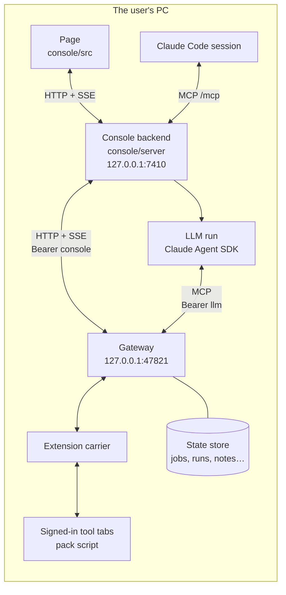
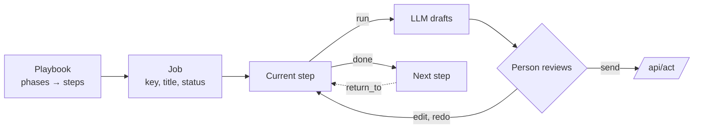

# Architecture

*Every box runs on one PC. The backend sees only the gateway. Tools are reached through tabs the
user already signed into, so no credential is ever stored.*

## Two kinds of concept

| Group | Concepts | Served by | Written by |
|---|---|---|---|
| A, sources | `work`, `board`, `review`, `chat`, `mail`, `cal`, `ci`, `tickets`, `docs`, `time` | the pack, in a tab | `/api/act`, only after a person confirms |
| B, state | `jobs`, `runs`, `playbooks`, `marks`, `notes`, `proposals` | the gateway's store | `/api/state/put` (compare-and-set on `v`) |

Each A concept is a list of items plus a detail by id; its schema is `schemas/<concept>.item.schema.json`
and `schemas/<concept>.get.schema.json`. A concept that cannot answer reports an error code and
the page shows it as unavailable, never as empty.

## Jobs, playbooks, steps

*A job walks a playbook one step at a time. A step may ask the LLM for a draft, and only a person
turns a draft into an act. A later step can send the job back to an earlier one, which starts a
new round.*

- Playbooks live in `console/src/data/playbooks.ts`. A playbook without `ws` is core and is offered
  in every workspace; one with `ws` belongs to that pack.
- The transition rules (start, done, skip, return, block, rounds) are in `console/src/model/transitions.ts`.
  The page and the backend share them.
- A workplace is described by a `Pack` in `console/src/data/packs.ts`: its tool names per concept,
  its projects, its vote words and its second clock.

## LLM runs

`console/server/llm/` runs one step at a time through the Claude Agent SDK.

- The prompt is built from the job, the step and the playbook's instructions.
- The run's tools come from the allowlist in `sdk.ts`: it can read A, search knowledge, and propose
  a note. It cannot act, and it cannot write B.
- The run hands back its draft with `submit_draft`. The page shows the draft, and a person sends it.
- The gateway serves the run's read tools as MCP at `{gateway}/mcp` with the `llm` token. The fake
  gateway does not serve `/mcp`, so a demo run uses the fake SDK in tests.

## Claude Code access

The backend serves its own MCP at `127.0.0.1:7410/mcp` (`console/server/mcp/mcp.ts`). It offers
the job tools (`list_jobs`, `get_job`, `job_command`, `create_job`, `start_item`, `undo`,
`list_playbooks`), so a terminal session can move jobs without the page. These are job commands,
not source acts.

## Notifications

`console/server/notify/` turns deltas into short notices: a new review vote, a red build, a
mention, a reminder. The page receives them over SSE. A phone gets them over the LAN port
7411 after pairing (`console/server/pairing/`).
