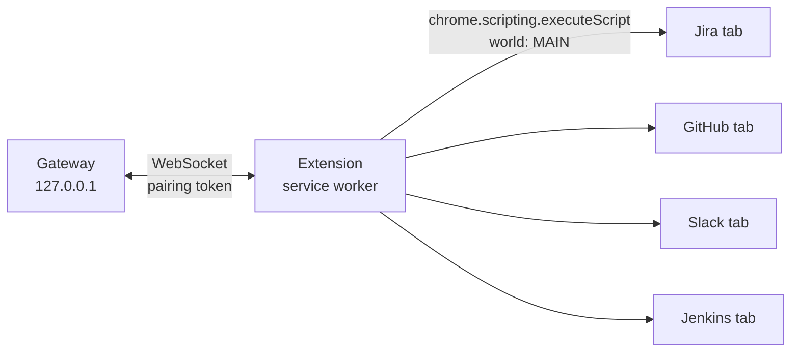

# Extension carrier (proposal)

> **Status: design only. Nothing here has been built or tried.** Every API claim below is a
> hypothesis to verify against the current Chrome/Edge extension docs before you build.

The carrier is the piece that runs a pack's script inside the user's signed-in tabs and passes the
results to the local gateway.

*The extension dials out to the gateway, because an extension cannot listen on a port. It holds
only the pairing token and no tool credentials.*

## Shape

- **Manifest V3.** `host_permissions` hold one pattern per tool host. `permissions` are `scripting`
  and `tabs`.
- **Packs are bundled at build time.** MV3 forbids remotely hosted code. Each pack's function is
  imported into the service worker and passed as `func`, never as a string.
- **Run a call:**
  1. Find the tab with `chrome.tabs.query` and the pack's `tabs.<name>.match`. If none matches,
     open `open` as a pinned background tab.
  2. Run `chrome.scripting.executeScript({target:{tabId}, world:'MAIN', func: pack, args:[call]})`.
  3. Return the injection's `result`.
  - **Hypothesis:** the promise from an async `func` is awaited and its value comes back as
    `result`.
  - **Hypothesis:** `world:'MAIN'` makes the function's `fetch` carry the page's cookies and pass
    its CSP.
- **Link to the gateway.**
  - The service worker keeps a WebSocket to the gateway.
    - **Hypothesis:** recent Chrome keeps a service worker alive while a WebSocket is active.
    - If not, fall back to an `alarms` ping and reconnect.
  - Frames are JSON: `{id, call}` in, `{id, result}` out.
  - The gateway owns the schedule (intervals, caps, retries); the carrier only runs calls.
- **Pairing.** The gateway prints a one-time code. The user pastes it into the extension's options
  page, and the extension stores the returned token in `chrome.storage.local`.

## Why not the alternatives

| Option | Problem |
|---|---|
| Native messaging host | Needs a registry entry or an installed manifest per machine, which counts as system config |
| CDP (`--remote-debugging-port`) | Needs a browser started with a flag, often blocked by policy |
| API tokens per tool | Each tool needs an admin-approved app or a personal token stored on disk |

## Verify first

1. A 20-line MV3 extension: `executeScript` in `MAIN` world runs a `fetch` to `/rest/api/2/myself`
   on the Jira tab, and the result reaches the service worker.
2. The service worker survives five minutes idle with an open WebSocket.
3. Company policy allows loading the extension (unpacked or from the company store).
