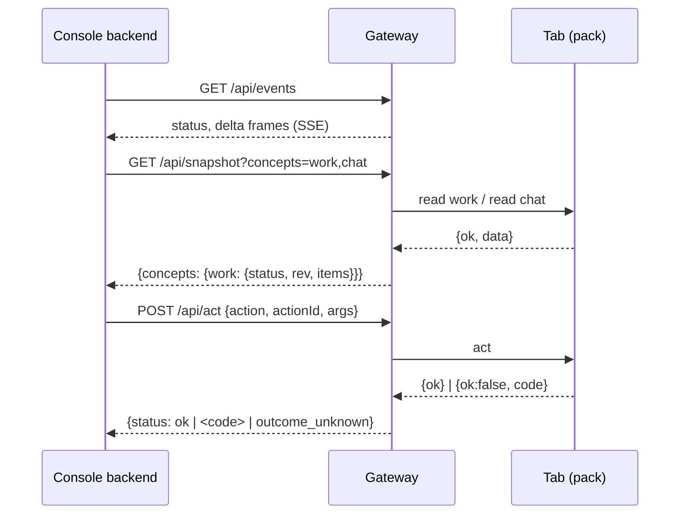

# Gateway protocol

The console backend's only external boundary. `console/server/bridge/fake.ts` implements all of it
in memory and is the executable reference; `console/server/bridge/wire.ts` holds the types.


*Reads are cached by the gateway and refreshed per concept on the pack's interval. A delta tells the
backend what changed, and the backend re-reads only that.*

## Auth

Every request carries `Authorization: Bearer <token>`. There are two callers:

| Caller | Token file (backend side) | May |
|---|---|---|
| `console` | `~/.bridge/console.token` | everything |
| `llm` | `~/.bridge/llm.token` | reads, `/mcp` |

The `llm` caller gets `403 {error:'forbidden_for_caller'}` on `/api/act`, `/api/state/put` and
`/api/state/new-job-id`. A missing or wrong token gets
`401 {error:'unauthorized'}`.

## Reply shape

Every endpoint except `/api/events` and `/api/snapshot` answers `200` with one reply:

```json
{ "status": "ok", "rev": 12, "items": ... }
{ "status": "<code>", "message": "..." }
```

- Source codes: `blank`, `unauthorized`, `rate_limited`, `not_found`, `bad_args`, `source_error`, `unknown`.
- State codes: `bad_request`, `not_found`, `conflict`, `too_large`.
- An act also has `outcome_unknown`: the write may or may not have happened, and the backend
  will not retry it.

## Endpoints

| Method, path | Body or query | `items` on ok |
|---|---|---|
| `GET /api/snapshot?concepts=a,b` | empty means all | the whole answer is `{bridge:{state,at}, counts:{chatUnread, mailToReply}, concepts:{name: reply}}` |
| `GET /api/items/{concept}/{id}` | optional `?cursor=` | the detail (`*.get` schema); for a B concept, the document |
| `POST /api/act` | `{action, actionId, args}` | the act's own result, or `null` |
| `POST /api/state/put` | `{concept, id, doc \| null, expectV}` | `{doc, replaced}`; `conflict` carries `{current}` |
| `POST /api/state/new-job-id` | none | `{id: 'J-0001'}`, always `J-NNNN`; a console renames it to its workspace's prefix and stores the job under that id, as `put` takes any id |
| `GET /api/events` | | SSE: `status` and `delta` frames |

Actions the backend knows: `chat.post`, `mail.send`, `review.vote`, `review.comment`,
`work.setState`, `work.comment`, `work.start` and `time.fill`. `actionId` is unique per
confirmation, and the gateway should drop a repeat.

A work get may list its pictures in `images`, at most 20, each `{ref, name, from}`. Its text names
each one `[image N]`, N being its place in that list. The list puts the description's, the repro
steps' and the acceptance criteria's first, then the comments', newest first; `from` says which, a
comment as `comment:<id>`. `image` is a get-only concept: `GET /api/items/image/{ref}` answers
`{name, mime, data, width, height}`, `data` being the picture in base64, and a read of it lists
nothing. A run gets the pictures its prompt names with that prompt; one the backend cannot read
says `[image N: unavailable]` there and never fails the run.

`put` with `expectV: null` creates the document; any other value must equal the stored `v`. The
stored document gets `v = expectV + 1` and `updated`. A document is capped at 256 KB.

## Events

```json
event: status
data: {"state":"up","machine":"pc","browser":"edge","concepts":{"work":"ok","chat":"unauthorized"},"at":"..."}

event: delta
data: {"concept":"work","fromRev":11,"toRev":12,"upserts":[{"id":"ACME-512"}],"removes":[],"resync":false}
```

- `status` arrives on connect and then every 10 s. `state: 'down'` is the gateway's own verdict
  that the browser or carrier is gone.
- On a `delta`, the backend re-reads the concept. `resync: true` means the change can't be described
  item by item.
- Some changes join across concepts: a mark changes `mail` and `chat`, and a job changes `chat`.
  The gateway sends a delta for each concept affected.
