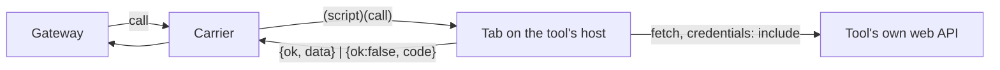

# Writing a pack

A pack is one directory: `pack.json` plus one script. The script is a single function, and the
carrier evaluates it in a signed-in tab of the tool. `packs/example/` is a worked pack for Jira
`work`. Copy it.


*The script runs as the page and uses the tab's own session. It never sees or returns a token.*

## pack.json

```json
{
  "name": "example",
  "zone": "UTC",
  "script": "example.js",
  "tabs": { "jira": { "match": "^https://[a-z0-9-]+\\.atlassian\\.net/", "open": "https://your-site.atlassian.net/jira/your-work" } },
  "concepts": { "work": { "tab": "jira", "interval": 30, "cap": 100 } },
  "actions": { "work.comment": { "tab": "jira", "concept": "work" } }
}
```

| Field | Meaning |
|---|---|
| `tabs.<name>.match` | Regex over the tab URL. The carrier runs the script only in a matching tab |
| `tabs.<name>.open` | Where to open the tab when no tab matches |
| `concepts.<c>.interval` | Seconds between reads |
| `concepts.<c>.cap` | Max items kept |
| `actions.<a>.concept` | Which concept to re-read after the act |

### Config and hosts

A pack that serves more than one workplace names no organisation, project or site. It declares the
settings it takes, and the workspace supplies the values.

```json
"config": {
  "org": { "about": "the organisation in the tool's URLs", "required": true, "pattern": "^[A-Za-z0-9-]+$" },
  "done": { "about": "states that count as closed", "list": true, "default": ["Done"] }
},
"hosts": ["tracker.example", "api.tracker.example"],
"tabs": { "site": { "match": "^https://tracker\\.example/{org}(/|$)", "open": "https://tracker.example/{org}" } }
```

| Field | Meaning |
|---|---|
| `config.<key>` | `about`, plus optional `required`, `default`, `pattern`, `enum`, and `list` for a list of strings |
| `hosts` | Every host the script may call. The tab's host is not added for you |
| `{key}` | A setting put into `tabs.*.match` (regex-escaped), `tabs.*.open` (URL-encoded) or `hosts` (as is, and the result must be a bare host name). A list key cannot be a template |

The console checks the workspace's values with `packConfig` and renders the templates with
`renderPack` (`console/server/bridge/packs.ts`). The script gets the values, defaults applied, as
`call.config`. It checks them again, because it runs on its own in the tab: a missing or malformed
value answers `bad_args` naming `config.<key>`, before any request.

## The call

```js
async function (call, env) { ... }   // env is injected only by tests
```

| `call.verb` | Also has | Return `data` |
|---|---|---|
| `read` | `concept`, `watch`, `zone`, `now` | an array of items (`<concept>.item` schema) |
| `get` | `concept`, `id` | one detail (`<concept>.get` schema) |
| `act` | `action`, `args` | the act's result, small |

`watch` maps a concept to the ids that jobs follow. A read includes them even when they don't
match the pack's default query. A get-only concept, such as `image`, answers a read with `[]`.

## Errors

Return `{ok:false, code, message, retryAfter?}` and never throw out of the function.

| Code | When |
|---|---|
| `blank` | The tab has not rendered yet |
| `unauthorized` | 401 or 403, a sign-in host, or an HTML page where JSON was expected |
| `rate_limited` | 429, with `retryAfter` in seconds |
| `not_found` | 404 |
| `bad_args` | An unknown verb or concept, or invalid args. Check before any request |
| `source_error` | Anything else that surely did not change the source |
| `unknown` | Something failed after a write went out, so the outcome is unknown |

## Rules

- Check the tab's host for every concept and action, so the script never acts on a sign-in page.
- Validate every id against a strict regex before it reaches a URL or a query (`KEY` in the example).
- Scrub tokens from every message (`scrub`).
- Return times as ISO UTC. The `zone` field is for display only.
- Keep the script self-contained, with no imports. The carrier serializes it.

## Tests

`packs/example/test/` runs the script in Node against a fake tab:

- `harness.mjs` provides a routed `fetch` that records each request, plus `location` and `document`.
- `validate.mjs` is a small JSON-schema check against `schemas/`.

```bash
node --test "packs/**/test/*.test.mjs"
```

Each concept needs at least these tests: one item passes the schema, the watched ids are honored,
injection is dropped, and an error envelope is covered.
