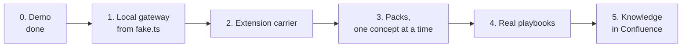

# Roadmap

*Each step can ship on its own. The page works the whole way through and shows any concept that is
not wired as unavailable.*

| Step | What | Done when |
|---|---|---|
| 0 | The page and backend on demo data; the fake gateway | `npm test`, `npm run build` and `npm run smoke` pass |
| 1 | A real local gateway: lift `console/server/bridge/fake.ts` into its own Node process on `127.0.0.1:47821`. It keeps B in a JSON file (see `console/server/store/file.ts`), caches A per concept, and serves `/mcp` with the read tools for LLM runs | The backend runs against it with `contract.test.ts` green, and an LLM run reads through `/mcp` |
| 2 | The carrier per [extension-carrier.md](extension-carrier.md), starting with the three "verify first" checks | One `read work` comes back from a real Jira tab |
| 3 | Packs per [concept-mapping.md](concept-mapping.md). Each concept gets contract tests, plus `docs.item` and `docs.get` schemas, which do not exist yet | The concept shows live in the page |
| 4 | Playbooks for the team's real flow (dev item, CI failure, review, support ticket) in `console/src/data/playbooks.ts` | A real issue walks from start to the QA hand-off |
| 5 | Knowledge notes: read from a Confluence space; accepted proposals become pages | A run's search finds a team page |

Not planned: anything hosted. The core runs on the user's PC only.
